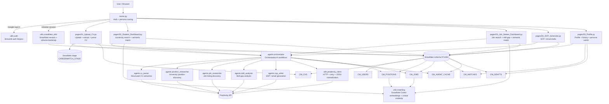

# CareerMatch

CareerMatch is an AI-powered multi-page Streamlit app for CV-driven discovery of academic opportunities and industry jobs.

It supports two user personas:

- Student: find Masters/PhD/Postdoc opportunities and generate SOP/email drafts.
- Job Seeker: find job opportunities, run semantic matching, analyze skill gaps, and persist matches.

## Table of Contents

- Overview
- Current Features
- Tech Stack
- Project Structure
- Quick Start
- Configuration
- Data Model and Snowflake Objects
- User Flows
- Caching and Performance
- Troubleshooting
- Development and Testing
- Security Notes

## Overview

CareerMatch combines:

- Streamlit for interactive multi-page UX.
- Snowflake for persistence, semantic vectors, and query acceleration.
- Perplexity-based agents for CV parsing, research, and generation tasks.
- Session + DB reuse patterns so users do not need to upload a CV every time.

## Architecture Diagram



### How It Works

- `Home.py` authenticates the user, initializes Snowflake, validates the Perplexity key, and routes the user into the student or job-seeker flow.
- `pages/01_Upload_CV.py` extracts text from PDF/DOCX uploads, stages the file in Snowflake, and stores parsed CV JSON.
- `agents/orchestrator.py` is the central coordination layer. It builds CV summaries, checks the cache, calls the specific agent, and persists successful AI results.
- The Perplexity agents handle CV parsing, university/job research, skill-gap analysis, and draft generation through `utils/perplexity_client.py`.
- `utils/matching.py` performs semantic ranking against Snowflake data using Cortex embeddings stored in `CM_POSITIONS` and `CM_JOBS`.
- `pages/05_Profile.py` provides the user history view for CVs, matches, drafts, and persona changes.

## Current Features

### 1. Authentication and Persona Routing

- Google sign-in using Streamlit built-in authentication.
- Persona selection from Home page:
  - Student
  - Job Seeker
- Perplexity API readiness warning appears if key is missing.

### 2. CV Upload and Parsing

- Upload CV as PDF or DOCX.
- Local text extraction with validation and size checks.
- Optional staging to Snowflake internal stage.
- AI parsing of CV into structured JSON.
- Parsed CV is stored in Snowflake (`CM_CVS`) and in session.

### 3. CV Reuse (No Re-upload Needed for AI Search)

- Student Dashboard and Job Seeker Dashboard allow selecting a previously uploaded parsed CV from Snowflake.
- Session CV can also be selected if present.
- This supports repeated searches without uploading every time.

### 4. Student Dashboard

- AI deep research for university positions.
- Filters:
  - Application Type
  - Continent
  - Open deadlines only
- Position cards with source links and professor details when available.
- SOP / Email generation shortcut from selected result.
- Semantic match tab against stored positions using Snowflake vector similarity.

### 5. Job Seeker Dashboard

- AI job research with optional custom instructions (for example location constraints).
- Semantic match tab against stored jobs using Snowflake vector similarity.
- Skill gap analysis per job.
- Save AI job results to Snowflake:
  - Inserts new jobs into `CM_JOBS` (deduplicated)
  - Inserts user match-history rows into `CM_MATCHES` (deduplicated)

### 6. SOP / Email Generator

- Generates SOP draft from selected position context + CV summary.
- Generates email draft to professor with selected position context.
- Allows editing before generation.
- Drafts can be saved in `CM_DRAFTS` and downloaded.

### 7. Profile Page

- View user details and persona.
- Switch persona.
- View CV upload history.
- View match history.
- View saved drafts.

## Tech Stack

| Layer | Technology |
|---|---|
| Frontend | Streamlit (multi-page app) |
| Auth | Streamlit built-in auth + Google |
| Backend DB | Snowflake (`IITJ.MH`) |
| Vector/Embedding | Snowflake Cortex `EMBED_TEXT_768` (`e5-base-v2`) |
| AI Research + Parsing | Perplexity API |
| HTTP client | `requests` |
| Lint/Test | `ruff`, `pytest` |

## Project Structure

```text
Home.py                          # Entry point: auth, Snowflake init, persona routing
pages/
  01_Upload_CV.py                # CV upload + extraction + AI parsing
  02_Student_Dashboard.py        # Student search + semantic match + CV reuse
  03_Job_Seeker_Dashboard.py     # Job search + custom instructions + save-to-DB + CV reuse
  04_SOP_Generator.py            # SOP/Email generation and draft save
  05_Profile.py                  # Profile, history, persona switch
agents/
  cv_parser.py
  position_researcher.py
  job_researcher.py
  skill_analyzer.py
  sop_writer.py
  orchestrator.py                # Caching, guardrails, orchestration
utils/
  auth.py
  cv_utils.py
  matching.py
  perplexity_client.py
  snowflake_utils.py
  ui_components.py
config/
  settings.py
  schema.sql                     # Reference DDL (runtime auto-creates objects)
tests/
  test_cv_utils.py
  test_perplexity_client.py
```

## Quick Start

### Prerequisites

- Python 3.11+
- Snowflake account with Cortex enabled
- Google OAuth credentials configured for Streamlit auth
- Perplexity API key

### Install

```bash
pip install -r requirements.txt
```

### Create secrets file

Create `.streamlit/secrets.toml` manually (no template file is currently checked in).

Suggested structure:

```toml
[connections.snowflake]
account = "<account>"
user = "<user>"
password = "<password>"
role = "<role>"
warehouse = "<warehouse>"
database = "IITJ"
schema = "MH"

[auth]
redirect_uri = "http://localhost:8501/oauth2callback"
cookie_secret = "<long-random-secret>"
client_id = "<google-oauth-client-id>"
client_secret = "<google-oauth-client-secret>"
server_metadata_url = "https://accounts.google.com/.well-known/openid-configuration"

[api_keys]
perplexity = "<perplexity-api-key>"
```

### Run

```bash
streamlit run Home.py
```

On first launch, the app auto-creates Snowflake stage/tables/performance objects.

## Configuration

Main settings are in `config/settings.py`.

Important values:

- `PERPLEXITY_MODEL` (default: `sonar-deep-research`)
- `PERPLEXITY_API_URL` (default: `https://api.perplexity.ai/chat/completions`)
- `CORTEX_EMBED_MODEL` (default: `e5-base-v2`)
- Allowed CV extensions and max size

Environment overrides supported:

- `PERPLEXITY_MODEL`
- `PERPLEXITY_API_URL`
- API key fallback envs such as `PERPLEXITY_API_KEY`

## Data Model and Snowflake Objects

Runtime bootstrap creates and manages:

- Stage:
  - `CAREERMATCH_STAGE`
- Tables:
  - `CM_USERS`
  - `CM_CVS`
  - `CM_POSITIONS`
  - `CM_JOBS`
  - `CM_MATCHES`
  - `CM_DRAFTS`
  - `CM_AGENT_CACHE`

Performance/maintenance actions at startup:

- Ensures embedding columns on positions/jobs.
- Adds search optimization on common filter/cache columns.
- Deletes expired rows from `CM_AGENT_CACHE`.

## User Flows

### Student flow

1. Login
2. Select Student persona
3. Upload and parse CV once
4. Reuse same CV from dashboard selector in future sessions
5. AI search positions or run semantic match
6. Generate SOP/Email

### Job Seeker flow

1. Login
2. Select Job Seeker persona
3. Upload and parse CV once
4. Reuse stored CV via dashboard selector
5. Add optional custom job instructions
6. AI search jobs
7. Save AI results to Snowflake (jobs + match history)
8. Run skill-gap analysis and semantic match

## Caching and Performance

- Agent responses are cached in `CM_AGENT_CACHE` with TTL.
- Cache keys include query context (job search also includes custom instructions).
- Position/job rows store embeddings for semantic ranking.
- Search optimization is enabled for key lookup/filter columns.

## Troubleshooting

### 1. AI features unavailable

Symptom:
- Home page warns that Perplexity key is missing.

Fix:
- Add one of:
  - `[api_keys].perplexity` in secrets
  - `PERPLEXITY_API_KEY` in secrets
  - `PERPLEXITY_API_KEY` env variable

### 2. Save AI jobs fails with VECTOR error

Symptom:
- Snowflake SQL compilation error about VECTOR in `VALUES` clause.

Fix status:
- Already handled in current code by using `INSERT ... SELECT` with `EMBED_TEXT_768`.

### 3. CV selector crashes with Snowpark Row AttributeError

Symptom:
- `Row object has no attribute get`.

Fix status:
- Already handled by index-style row access (`row["PARSED_JSON"]`).

### 4. Semantic match says CV text not found

Reason:
- Semantic tab uses in-session `cv_text`; stored parsed CV reuse supports AI search even when `cv_text` is absent.

Workaround:
- Re-upload CV to refresh in-session raw text, or rely on AI search tab.

## Development and Testing

### Lint

```bash
ruff check .
```

### Tests

```bash
pytest tests/ -v
```

Current tests cover:

- Perplexity client behavior (including retries and response normalization)
- CV utility validation and DOCX extraction paths

## Security Notes

- Do not commit `.streamlit/secrets.toml`.
- Use parameterized SQL queries (already used across the app).
- Keep API keys in secrets/env only.
- Uploaded filenames are timestamped/sanitized before stage upload.

## License

Apache-2.0
